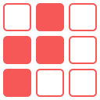

# Filtreur.js

**Declarative user interface library for filtering elements on a web page.**

See [**demo and documentation here**](https://www.achrafkassioui.com/filtreur/).

*Work in progress. Documentation will be updated once v1.0 is released.*
